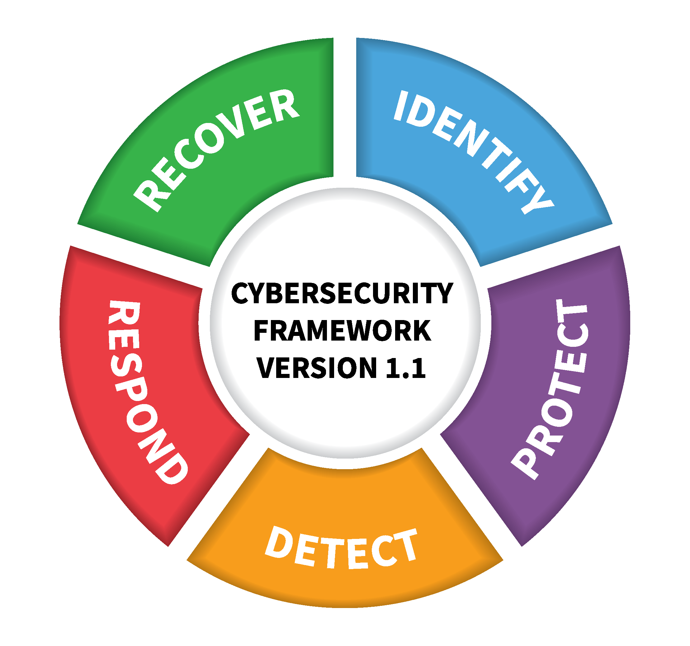

# NIST-CYBERSECURITY-FRAMEWORK-V1.1
<h2>DISCLAIMER:</h2>
The <strong>"MIT-LICENCE"</strong> guides this repository. You have the permission to use, copy, modify, merge, publish, distribute, sublicense, or reupload this content to any GitHub Repository. However, we kindly ask that you give credit to <strong>"Fixitgearware Security"</strong>. We have a strong belief that you will abide by the cybersecurity rules, ethics, and conducts. 
Copyright (c) 2023 FixitgearwareSecurity.
 
<strong>Published Date:</strong>&nbsp;01-NOVEMBER-2023.
 
<h2>For any complaints or Error Email:</h2> <strong>report@fixitgearware.com</strong>
 

 
<h2>MIT LICENCE</h2>
<a href="https://github.com/fixitgearware/NIST-CYBERSECURITY-FRAMEWORK-V1.1/blob/main/LICENSE">Read the MIT-LICENCE</a>
  

Reference Guide in Planning Organizations "Risk Assessment &amp; Risk Management" using the cybersecurity framework.

 
The <a href="https://www.fixitgearware.com/cybsec-news/cyber-security/the-nist-cyber-security-framework/2023/09/07/">NIST Cyber Security framework (V1.1)</a>, originated from the United States of America's concern for its national and economic security, which heavily relies on the functioning of critical infrastructures.  To ensure the resilience and longevity of these infrastructures, Barack Obama, who was the President of the United States at the time, issued <a href="https://www.dhs.gov/publication/executive-orders-13636-and-13691-privacy-and-civil-liberties-assessment-reports#:~:text=Executive%20Order%2013636%2C%20Improving%20Critical,neutral%20cybersecurity%20framework%2C%20and%20to">Executive Order 13636 (EO) (Executive Orders 13636 and 13691 Privacy and Civil Liberties Assessment Reports)</a>, titled <strong>“Improving Critical Infrastructure Cybersecurity”</strong> on February 12th, 2013.  

This executive order initiated the voluntary development of a Cybersecurity Framework. This framework offers a <strong>“prioritized, flexible, repeatable, performance-based, and cost-effective approach,”</strong> assisting organizations that use critical infrastructure services in managing cybersecurity risk.
  
Below is a brief summary of this framework's functions. For a detailed view of the various functions and their applications in planning your organization's risk assessment, please follow the corresponding Github repository link for each function.  

<table>
<tr>
<td><strong>FUNCTION</strong></td><td><strong>ID</strong></td><td><strong>BRIEF EXPLANATION</strong></td><td><strong>CATEGORIES</strong></td><td><strong>RESOURCE URL</strong></td>
</tr>

<td> IDENTIFY</td><td> ID </td><td> The NIST Cybersecurity Framework's <strong>"IDENTIFY" </strong> function plays a crucial role in comprehending an organization's cybersecurity risk management for its assets, which include personnel, systems, data, and functions. 
 This function provides a deep understanding of the organization's business environment and the risks involved. Consequently, it enables the organization to devise a well-structured action plan and prioritize its efforts in line with its risk management strategy and business requirements. </td><td> &#x2022; Asset Management  <strong>(ID.AM)</strong>   &#x2022; Business Environment  <strong>(ID.BE)</strong>    &#x2022; Governance <strong>(ID.GV)</strong>   &#x2022; Risk Assessment  <strong>(ID.RA)</strong>   &#x2022; Risk Management Strategy  <strong>(ID.RM)</strong> </td><td>&#x2022; <strong>Website :</strong> <a href="https://www.fixitgearware.com/cybsec-news/cyber-security/the-nist-framework-cheatsheet-for-identify/2023/09/11/" target="_blank">Identify Function.</a>  &#x2022; <strong>GitHub :</strong><a href="https://github.com/fixitgearware/NIST-CYBERSECURITY-FRAMEWORK-V1.1/blob/main/IDENTIFY.md" target="_blank">Repository</a></td>
</tr>

<td> PROTECT </td><td> PR </td><td>The <strong>"Protect"</strong> function of the NIST Cybersecurity Framework actively develops and implements relevant security measures to ensure the delivery and functionality of critical services (Infrastructures).  
This function involves the implementation of security controls with the primary goal of protecting classified and private information, as well as business-critical systems, thereby mitigating risks. By doing so, it contains the potential impact of a cybersecurity breach or attack. </td><td> &#x2022; Access Control <strong>(PR.AC)</strong>   &#x2022; Awareness & Training  <strong>(PR.AT)</strong>    &#x2022; Data Security  <strong>(PR.DS)</strong>   &#x2022; Information Protection, Processes, and Procedures  <strong>(PR.IP)</strong>   &#x2022; Maintenance <strong>(PR.MA)</strong>  &#x2022; Protective Technology <strong>(PR.PT)</strong></td><td>&#x2022; <strong>Website :</strong> <a href="https://www.fixitgearware.com/cybsec-news/cyber-security/part2-the-nist-framework-cheatsheet-for-protect/2023/10/03/" target="_blank">Protect Function.</a>  &#x2022; <strong>GitHub  :</strong><a href="https://github.com/fixitgearware/NIST-CYBERSECURITY-FRAMEWORK-V1.1/blob/main/PROTECT.md" target="_blank">Repository</a></td>
</tr>

<td> DETECT </td><td> DE </td><td>The <strong>"Detect"</strong> function of the NIST Framework actively develops and implements suitable security measures and principles to spot any cybersecurity breaches or incidents.  Its main goal is to enable the organization to promptly detect any unusual activity on its systems or network and comprehend its potential impact.  </td><td>&#x2022; Anomalies and Events  <strong>(DE.AE)</strong>   &#x2022; Security Continuous Monitoring  <strong>(DE.CM)</strong>    &#x2022; Detection Processes  <strong>(DE.DP)</strong></td><td>&#x2022; <strong>Website :</strong> <a href="https://www.fixitgearware.com/cybsec-news/cyber-security/part3-the-nist-framework-cheatsheet-for-detect/2023/10/04/" target="_blank">Detect Function.</a>   &#x2022;<strong>GitHub  :</strong><a href="https://github.com/fixitgearware/NIST-CYBERSECURITY-FRAMEWORK-V1.1/blob/main/DETECT.md" target="_blank">Repository</a></td>
</tr>

<td> RESPOND </td><td> RS </td><td>The <strong>"Respond"</strong> function, a core feature of the NIST Cybersecurity Framework, actively guides the necessary steps to take when a cybersecurity incident is detected. The actions taken shape the response and determine the potential impact level of a cybersecurity incident.  </td><td>&#x2022; Response Planning  <strong>(RS.RP)</strong>   &#x2022; Communications  <strong>(RS.CO)</strong>    &#x2022; Analysis  <strong>(RS.AN)</strong>   &#x2022; Mitigations  <strong>(RS.MI)</strong>   &#x2022; Improvements  <strong>(RS.IM)</strong> </td></td><td>&#x2022; <strong>Website :</strong> <a href="https://www.fixitgearware.com/cybsec-news/cyber-security/part4-the-nist-framework-cheatsheet-for-respond/2023/10/05/" target="_blank">Respond Function.</a>  &#x2022;<strong>GitHub  :</strong><a href="https://github.com/fixitgearware/NIST-CYBERSECURITY-FRAMEWORK-V1.1/blob/main/RESPOND.md" target="_blank">Repository</a></td>
</tr>

<td> RECOVER </td><td> RC </td><td>The NIST Cybersecurity Framework's <strong>"Recover"</strong> function emphasizes the need to create and execute essential activities that maintain resilience, restore functions, and services affected by a cybersecurity event.  
This function should facilitate a swift return to regular business operations after cybersecurity incidents, minimizing the organization's impact. It accentuates the need to address existing threats with practical solutions, rather than relying solely on defense.
  </td><td> &#x2022; Recovery Planning  <strong>(RC.RP)</strong>   &#x2022; Improvements  <strong>(RC.IM)</strong>    &#x2022; Communications. <strong>(RC.CO)</strong><td>&#x2022; <strong>Website :</strong> <a href="https://www.fixitgearware.com/cybsec-news/cyber-security/part5-the-nist-framework-cheatsheet-for-recover/2023/10/06/" target="_blank">Recover Function.</a>  &#x2022; <strong>GitHub  :</strong><a href="https://github.com/fixitgearware/NIST-CYBERSECURITY-FRAMEWORK-V1.1/blob/main/RECOVER.md" target="_blank">Repository</a></td>
</tr>
